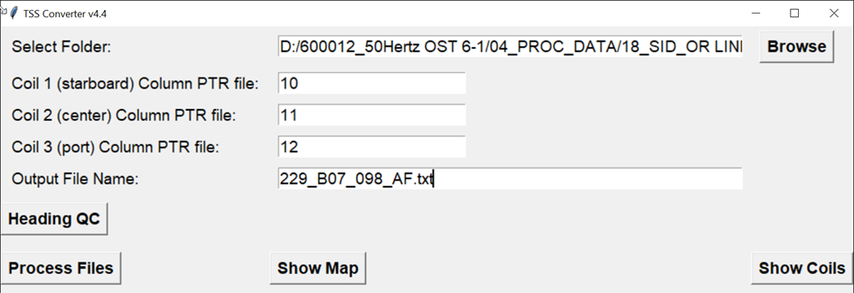
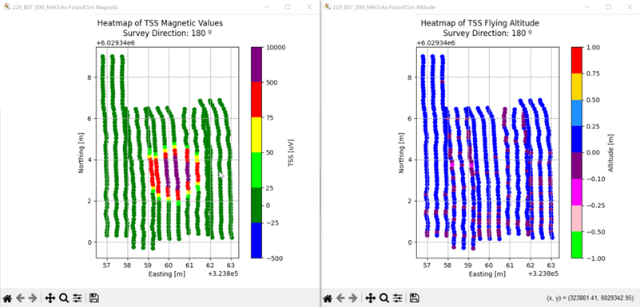
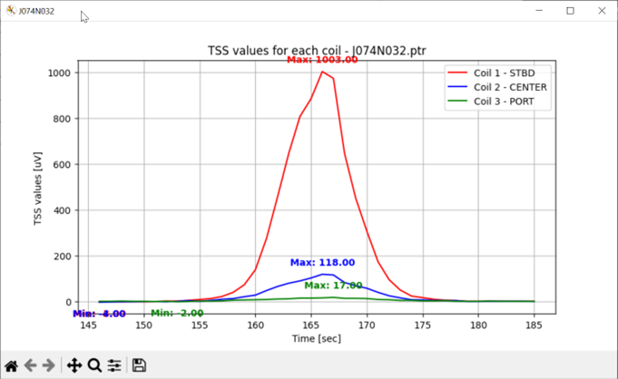
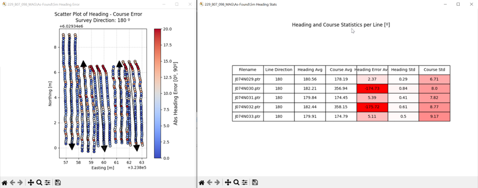

# **TSS Converter v4.5**

## **Overview**
TSS Converter v4.5 is a Python-based tool for processing and analyzing **electromagnetic survey data** from **Teledyne Pipetarcker TSS440 and Visualsoft Navigation CSV files** exported from **EIVA NaviEdit**. It extracts, merges, and analyzes **navigation and electromagnetic data** from UXO detection surveys, allowing users to:
- Process raw **PTR files** and navigation data.
- Generate **heatmaps** and **quality control plots**.
- Calculate **heading errors** and survey statistics.
- Export processed data in a structured format.

---
## **Installation**
### **1. Clone the Repository**
```bash
git clone https://github.com/Vidanfra/TSS-FILE-CONVERTER 
cd TSSConverter
```
### **2. Install Required Dependencies**
Ensure you have Python **3.7+** installed. Install required packages with:
```bash
pip install -r requeriments.txt
```
If `requirements.txt` is missing, install manually:
```bash
pip install pandas matplotlib numpy scipy tk
```
---
## **Usage**
### **1. Run the Script**
Run the script from the command line or a Python environment:
```bash
python TSSconverter4.py
```
Alternatively, double-click the `TSSconverter v4.4.exe` file to launch the script.


### **2. Select Input Data**
- Click **Browse** to select the folder containing **PTR and CSV files**.
- Ensure **PTR files** and corresponding **Coil navigation CSV files** are present.
- You must use the **column numbers** for each coil in the PTR files by default **[Coil 1 = 10, Coil 2 = 11, Coil 3 = 12]**.
- You only need to change column numbers if the convention in NaviEdit or TSS DeepView is changed.

### **3. Process Data**
- **Process Files**: Extract and merge navigation and electromagnetic data.
- **Show Map**: Generate a **heatmap** of **TSS electromagnetic values** and **altitude**.
- **Show Coils**: Plot **TSS values** for each coil.
- **Heading QC**: Display heading quality control statistics.

### **4. Export Processed Data**
- The processed data is saved in the selected folder as **BOSSE_XXX_A.txt** (default).
- Coil peak values are saved separately in **BOSSE_XXX_A_coil_peaks.csv** (default).

---

## **File Naming Conventions**
| File Type  | Naming Format        | Description |
|------------|---------------------|-------------|
| PTR File  | `Survey_XYZ.ptr`     | Raw TSS data |
| Coil 1 Nav | `Survey_XYZ_Coil_1.csv` | Navigation for Coil 1 |
| Coil 2 Nav | `Survey_XYZ_Coil_2.csv` | Navigation for Coil 2 |
| Coil 3 Nav | `Survey_XYZ_Coil_3.csv` | Navigation for Coil 3 |
| Output     | `BOSSE_XXX_A.txt`   | Processed TSS Data |
| Coil Peaks | `BOSSE_XXX_A_coil_peaks.csv` | Peak values per coil |

---

## **Features & Functionality**
### ✅ **Data Processing**
- Reads **pipetracker files** and corresponding **navigation CSVs**.
- Matches timestamps between **PTR** and **navigation** data.
- Swaps coil numbers to match **TSS DeepView** with **NaviEdit Offsets** conventions.
- Exports an output `.txt` file to create **TSS electromagnetic values** and **altitude** in **NaviModel**.
- Exports an output `.csv` file cointaining the **TSS peak values of each coil at each line** of the survey.

### ✅ **Analysis & Visualization**
- **Heatmaps** for **TSS electromagnetic values** and **altitude**.

- **Coil plots** showing TSS variations over time.

- **Heading Quality Control (QC)** with statistical analysis.


### ✅ **Error Handling & Logging**
- **Logs errors and warnings** for missing or inconsistent data.
- Provides **user-friendly warnings** and **alerts** via GUI.

---

## **Troubleshooting**
### ❓ Coils position looks swapped in the heatmaps
✔ Check that the **coils numbers convention is what is expected** in both files.

✔ Check **column numbers** for TSS values.

✔ By default the coils numbers convention are:

- TSS DeepView: **[Coil 1 = Starboard, Coil 2 = Central, Coil 3 = Port]**
- NaviEdit Offsets: **[Coil 1 = Port, Coil 2 = Central, Coil 3 = Starboard]**
### ❓ No data appears after processing
✔ Ensure the **PTR and CSV files** are correctly formatted and in the selected folder.  
✔ Check **column numbers** for TSS values.

### ❓ Time mismatch errors
✔ Ensure **navigation and PTR timestamps** match within **0.25 seconds**.  
✔ Sometimes **files may contain several points not paired** on time.
✔ Check the files **if you get more than 5 or 10 points mismached**.

### ❓ Missing Navigation Files warning
✔ Make sure all **three coil navigation CSVs** exist and are named correctly for each **PTR file**.

---

## **Contributing**
Feel free to **fork** this repository, submit **issues**, and open **pull requests** for improvements.

👨‍💻 **Author:** Vicente Danvila Fraile

📧 **Contact:** vicente.danvila@reachsubsea.com  
